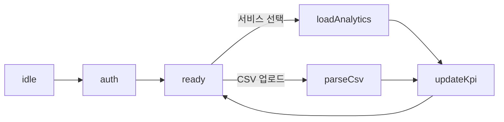
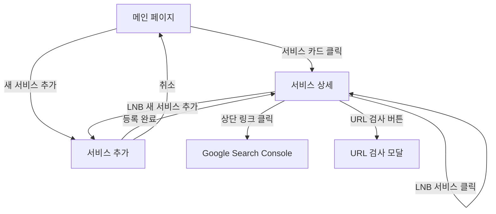

# CLAUDE.md

This file provides guidance to Claude Code (claude.ai/code) when working with code in this repository.

## Project Overview

This is a SEO integration management CMS built with React, TypeScript, and Vite. The project uses modern React (v19) with a minimal setup focused on performance and developer experience.

## Development Commands

- `npm run dev` - Start the development server (runs on port 3000)
- `npm run build` - Build the project for production (runs TypeScript build and Vite build)
- `npm run lint` - Run ESLint to check for code quality issues
- `npm run preview` - Preview the production build locally

## Project Architecture

The project follows a standard Vite + React + TypeScript setup:

- `/src` - Main source code
  - `App.tsx` - The main React component
  - `main.tsx` - Entry point that renders the React application

## Configuration

The project uses several configuration files:

- `vite.config.ts` - Vite configuration (sets up React plugin and server port 3000)
- `tsconfig.json` - References to TypeScript configurations
- `tsconfig.app.json` - TypeScript configuration for the application code
- `tsconfig.node.json` - TypeScript configuration for Node.js code (Vite config)
- `eslint.config.js` - ESLint configuration using the new flat config format with TypeScript and React plugins

## TypeScript Configuration

The project uses TypeScript with strict type checking enabled. Both app and node configurations enforce:

- Strict type checking
- No unused locals or parameters
- No unchecked side effect imports
- No fallthrough cases in switch statements

## Browser Support

The application targets modern browsers with ES2020 support.

## Response Rules

모든 질문에 대해 한국어로 먼저 응답한 후 필요한 경우 영어로 추가 설명합니다.
모든 질문에 대해 답변시 추가적으로 고려해야 하는 부분도 함께 설명합니다.
모든 질문에 대해 코드 작성은 별도 작성 요청을 하지 않는 경우 적용하지 않습니다.
개발 코드 작성시 함수나 hook등을 생성할 땐 항상 jsDoc 형식의 주석을 함께 추가하여 어떤 기능을 제공하는지 설명하도록 합니다.
기능 개발의 경우 아래 SEO 데이터 CMS 기획서를 바탕으로 개발하도록 합니다

# SEO 데이터 CMS 기획서

## 1. 프로젝트 개요

- **목적**: 다수의 웹서비스(도메인)의 Google Search Console(GSC) 지표와 색인·크롤링 상태를 _로그인·백엔드·DB 없이_ 한 화면에서 모니터링.
- **기술 스택**: React + Vite 정적 배포, 클라이언트 측 OAuth 2.0 PKCE, Chart.js/Recharts, SWR or React‑Query, Refine 프레임워크.
- **데이터 원천**: GSC 공식 Search Analytics API, URL Inspection API, Search Console UI Export CSV(Page Indexing, Crawl Stats).

## 2. 핵심 기능

| 카테고리               | 상세 기능                                                                                                    | 비고                      |
| ---------------------- | ------------------------------------------------------------------------------------------------------------ | ------------------------- |
| **메인 화면**          | · 서비스 대시보드 카드 목록 <br>· 서비스 요약 정보 표시 <br>· 서비스 카드 클릭 시 상세 페이지 진입           | 최대 10개 서비스          |
| **서비스 관리**        | · 서비스 등록/삭제(localStorage) <br>· PKCE OAuth 연결 <br>· 서비스별 Search Console 원본 페이지 링크        | 간편 관리                 |
| **지표 대시보드**      | · 클릭수·노출수·CTR·평균 순위 <br>· 색인된/미색인 페이지 <br>· 최근 90일 크롤링 횟수 <br>· 평균 응답속도(ms) | KPI 8개 타일, 증감률 배지 |
| **트렌드 차트**        | · 기간 선택(7·30·커스텀) <br>· 4개 지표 토글(Line/Area)                                                      | 30일↑ → 7일 이동평균      |
| **색인·크롤링 리포트** | · 탭: "색인", "크롤 통계" <br>· CSV 업로드 드롭존 → 그래프/테이블                                            | 형식 자동감지             |
| **URL 검사**           | · 검사 모달: URL 입력 → 실시간 상태 반환                                                                     | URL Inspection API        |
| **설정(옵션)**         | · 캐시 초기화 <br>· 부가 기능 설정                                                                           | 간단 오프캔버스           |

## 3. 화면 구조

### 3-1. 메인 화면

```
┌─ 상단 헤더 ──────────────────────────────────────────────────────┐
│ • 앱 로고 및 타이틀                                             │
│ • 새 서비스 추가 버튼                                           │
└───────────────────────────────────────────────────────────────────┘
┌─ 서비스 대시보드 카드 영역 ─────────────────────────────────────┐
│ ┌─────────┐ ┌─────────┐ ┌─────────┐                             │
│ │ 서비스1 │ │ 서비스2 │ │ 서비스3 │ ...                         │
│ │ 요약지표│ │ 요약지표│ │ 요약지표│                             │
│ └─────────┘ └─────────┘ └─────────┘                             │
└───────────────────────────────────────────────────────────────────┘
```

### 3-2. 서비스 상세 페이지

```
┌─ LNB(좌측 내비게이션) ─┐  ┌─ 콘텐츠 영역 ─────────────────────────────┐
│ • 서비스 전환 목록     │  │ ◇ 서비스 타이틀 & 원본 콘솔 링크          │
│ • + 서비스 추가        │  │ ◇ KPI 8타일 (2행×4열)                   │
│ • 부가 기능 메뉴       │  │ ◇ 기간 선택기 & 증감률                  │
│                        │  │ ◇ 트렌드 차트 + 지표 토글               │
│                        │  │ ◇ 탭: 색인 │ 크롤 통계                  │
└────────────────────────┘  │ ◇ URL 검사 모달(오버레이)               │
                            └──────────────────────────────────────────┘
```

## 4. KPI 정의

| 지표             | 산출 방식             | 데이터 소스          |
| ---------------- | --------------------- | -------------------- |
| 클릭수           | 합계(clicks)          | Search Analytics API |
| 노출수           | 합계(impressions)     | "                    |
| CTR              | clicks ÷ impressions  | "                    |
| 평균 순위        | 평균(position)        | "                    |
| 색인된 페이지    | Σ Indexed             | Page Indexing CSV    |
| 미색인 페이지    | Σ Not Indexed         | Page Indexing CSV    |
| 최근 크롤링 횟수 | Σ Total Requests(90d) | Crawl Stats CSV      |
| 평균 응답속도    | Σ Response Time ÷ N   | Crawl Stats CSV      |

## 5. API·파일 명세

### 5‑1 Search Analytics

```
POST /webmasters/v3/sites/{propertyUrl}/searchAnalytics/query
body: { startDate, endDate, dimensions:["date"], rowLimit }
제한: 50 000 rows / 1 200 QPM
```

### 5‑2 URL Inspection

```
POST /urlInspection/index:inspect
body: { siteUrl, url }
응답: inspectionResult.indexStatusResult.coverageState 등
```

### 5‑3 CSV 스키마(요약)

| 파일                 | 필드                                       | 사용 KPI         |
| -------------------- | ------------------------------------------ | ---------------- |
| page-indexing-\*.csv | Date, Indexed, Not Indexed                 | 색인, 미색인     |
| crawl-stats-\*.csv   | Date, Total Requests, Avg ResponseTime(ms) | 크롤링, 응답속도 |

## 6. 클라이언트 인증 흐름

1. 서비스 추가 모달 → Google OAuth 동의(웹 SPA PKCE).
2. `access_token` (60 min) → `sessionStorage` 보관.
3. 만료 시 silent refresh, 실패 시 재로그인 안내.
4. 토큰은 클라이언트에만 존재 → 개인/소규모 내부 용도 전제.

## 7. 캐싱 전략

| 레이어       | 방식             | TTL  |
| ------------ | ---------------- | ---- |
| 메모리       | SWR/React‑Query  | 5 분 |
| localStorage | 마지막 응답 캐시 | 24 h |

## 8. 상태 기계(FSM)



## 9. 페이지 이동 흐름



## 10. 향후 고도화 아이디어

- BigQuery Bulk Export 연동 → 서버 없이 자동 색인·크롤링 데이터 취득
- Slack/메일 알림(지표 급변, 색인 오류) – Webhook 기반
- GA4 전환·트래픽 통합 → SEO + 사용자 행태 한눈에
- 간단한 AI 이상치 감지 → 교차트렌드 아웃라이어 표시

---
